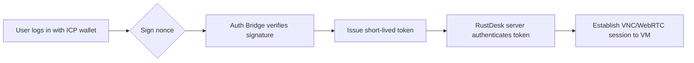

# RustDesk + ICP DApp Architecture

## Summary
A high‑level architecture that combines the open‑source remote‑desktop protocol RustDesk with an Internet Computer Protocol (ICP) dapp. The design keeps the core RustDesk server untouched, adds an ICP‑based authentication layer, and provisions virtual machines via libvirt/KVM or cloud providers.

## Components
1. **RustDesk Server** – Existing RustDesk server (REST/WS API) stays unchanged.
2. **ICP Canister** – Auth canister issues short‑lived tokens after users sign a nonce with their ICP wallet.
3. **Auth Bridge** – Off‑chain service that verifies ICP signatures, maps to user identity, and returns a JWT for RustDesk.
4. **VM Provisioning Service** – Manages VMs (libvirt/KVM or cloud) and supplies connection details to RustDesk.
5. **DApp Frontend** – Hosted on IPFS or served from an ICP canister; lets users log in via ICP wallet, request a VM session, and connects through RustDesk WebRTC/VNC.

## Flow Diagram

## Notes
- Tokens are JWTs signed by the Auth Canister and accepted by RustDesk for authentication.
- The bridge can be implemented in any language; a lightweight Go or Rust service is common.
- VM provisioning can use libvirt/KVM on‑premise or an AWS EC2/Google Cloud instance with custom SSH keys.

## Links
[[RustDesk]]
[[ICP]]
[[WebRTC]]
[[IPFS]]
[[JWT]]
[[libvirt]]
[[KVM]]
[[WebAssembly canister]]
