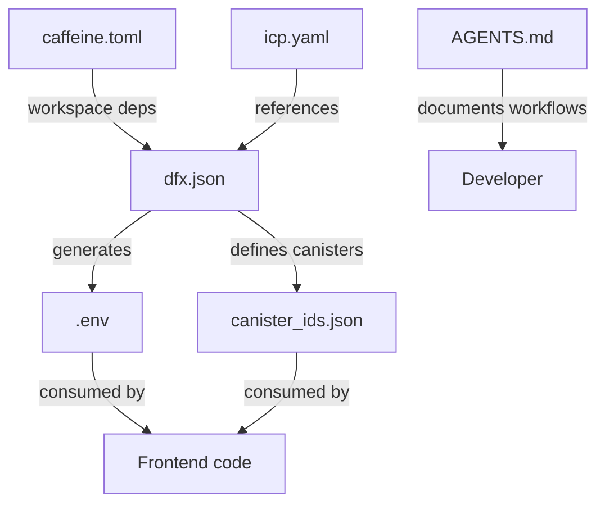

# Environment and Workspace Configuration

Minegold.brave uses multiple configuration files to manage its development environment, workspace dependencies, and canister lifecycle. This note documents how these files work together to create a cohesive development experience.

## Environment Variables (.env)

The `.env` file is **auto-generated** by DFX (configured via `dfx.json` with `"output_env_file": ".env"`) and contains canister deployment metadata:

```bash
DFX_VERSION='0.31.0'
DFX_NETWORK='local'
CANISTER_ID_FRONTEND='umunu-kh777-77774-qaaca-cai'
CANISTER_ID_BACKEND='uzt4z-lp777-77774-qaabq-cai'
CANISTER_ID_INTERNET_IDENTITY='uxrrr-q7777-77774-qaaaq-cai'
CANISTER_ID='uzt4z-lp777-77774-qaabq-cai'
CANISTER_CANDID_PATH='/mnt/c/Users/Anthony/Downloads/minegold.defi/src/backend/dist/backend.did'
```

### Key Environment Variables

| Variable | Purpose | Notes |
|----------|---------|-------|
| `DFX_VERSION` | Specifies DFX CLI version | Ensures version consistency across environments |
| `DFX_NETWORK` | Current deployment target | `local` for development, `ic` for mainnet |
| `CANISTER_ID_*` | Deployed canister identifiers | Generated after `dfx deploy`, used by frontend to call backend |
| `CANISTER_CANDID_PATH` | Path to interface definition | Used for type-safe inter-canister calls |

**Important**: This file is regenerated on each deployment. Do not manually edit or commit changes.

## Workspace Configuration (caffeine.toml)

Caffeine is a workspace orchestration tool that manages multi-canister dependencies:

```toml
manifest_version = "0.1.0"

[project]
id = "my-app"
name = "my-app"

[workspace]
include = ["src/**"]

[canisters.frontend]
depends_on = ["backend"]
```

### Dependency Graph

The `depends_on` declaration ensures **build order**:
1. Backend canister builds first (Motoko → WASM)
2. Frontend bindings are generated from backend Candid interface
3. Frontend builds with type-safe backend access

This matches the DFX configuration where `frontend` declares `"dependencies": ["backend"]` in [[project-configuration|dfx.json]].

## ICP CLI Configuration (icp.yaml)

Minimal configuration for the ICP CLI tool:

```yaml
canisters:
  - src/frontend
  - src/backend
```

This file:
- Declares canister source directories for the ICP CLI
- Complements DFX configuration (does not replace it)
- Used by ICP-specific deployment tooling

## Project Guidance (AGENTS.md)

This file serves as a **living runbook** for verified development commands. It's designed to be updated by developers and AI agents as workflows are validated.

### Verified Commands

**Frontend** (run from `src/frontend/`):
```bash
pnpm install --prefer-offline  # Install dependencies
pnpm typecheck                 # Type checking
pnpm fix                       # Lint and auto-fix
pnpm build                     # Production build
```

**Backend** (run from `src/backend/`):
```bash
mops install                   # Install Motoko packages
mops check --fix               # Type check and auto-fix
mops build                     # Compile to WASM
```

**Integration** (run from root):
```bash
pnpm bindgen                   # Generate TypeScript bindings from Candid
```

### Why AGENTS.md Matters

1. **Single source of truth**: Prevents command drift across documentation
2. **AI-friendly**: Designed to be read and updated by autonomous agents
3. **Workflow validation**: Commands are verified before being documented
4. **Context preservation**: Captures learnings and preferences over time

See [[developer-tooling-and-automation]] for how these commands integrate with CI/CD.

## Environment-Specific Behavior

### Local Development
```bash
DFX_NETWORK='local'
# Uses ephemeral replica at 127.0.0.1:4943
# Canister IDs are deterministic but local-only
```

### Mainnet Deployment
```bash
DFX_NETWORK='ic'
# Uses persistent IC network
# Canister IDs are globally unique and permanent
```

The network switching is handled by:
- `dfx deploy --network ic` (explicit network flag)
- [[mainnet-launch-procedures|Launch scripts]] that set environment appropriately

## Configuration File Relationships



## Common Gotchas

### Stale Environment Variables
**Problem**: Frontend can't find backend after redeployment  
**Cause**: `.env` wasn't regenerated or wasn't sourced  
**Fix**: Run `dfx deploy` again or manually source `.env`

### Wrong Network Context
**Problem**: Deploying to wrong network  
**Cause**: `DFX_NETWORK` set incorrectly or cached  
**Fix**: Check `dfx.json` network defaults, use explicit `--network` flags

### Missing Bindings
**Problem**: TypeScript errors about unknown backend methods  
**Cause**: Forgot to run `pnpm bindgen` after backend changes  
**Fix**: Always run bindgen after modifying backend interface (see [[data-flow-and-transaction-lifecycle]])

### Build Order Failures
**Problem**: Frontend builds before backend  
**Cause**: Dependency declaration missing or ignored  
**Fix**: Verify `caffeine.toml` and `dfx.json` both declare frontend → backend dependency

## Best Practices

1. **Never commit `.env`**: It contains deployment-specific IDs that vary across environments
2. **Commit `canister_ids.json`**: Preserves production canister IDs for reproducible deployments
3. **Keep AGENTS.md updated**: Document new workflows as they're validated
4. **Use `--prefer-offline`**: Speeds up local development by using pnpm cache
5. **Verify canister dependencies**: Frontend should always list backend as dependency

## Related Documentation

- [[project-configuration]] - DFX and package manager setup
- [[build-and-deploy-process]] - How these configs are used during deployment
- [[developer-tooling-and-automation]] - CI/CD integration
- [[mainnet-launch-procedures]] - Environment-specific deployment steps
