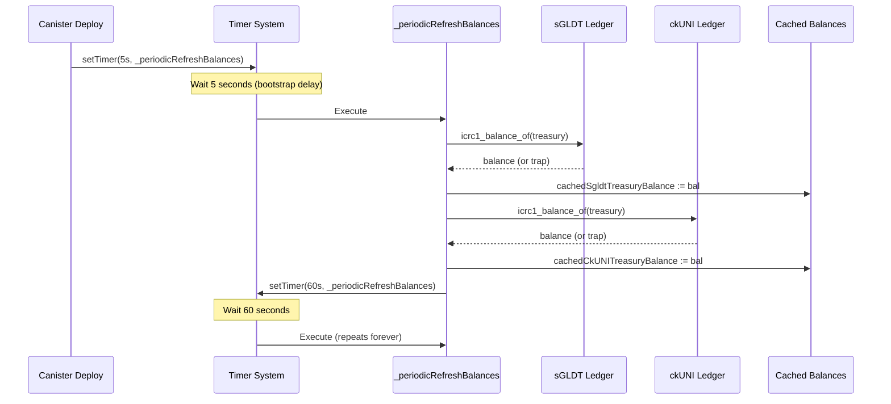

# ICP Runtime Patterns and Optimization

Comprehensive documentation of Internet Computer-specific runtime features, lifecycle patterns, and optimization techniques used in Minegold.brave.

## Automatic Stable Variable Persistence

Unlike traditional smart contract platforms, Motoko actors use **automatic state persistence** without explicit serialization:

```motoko
actor Self {
  // All actor-level vars are automatically stable across upgrades
  var nextBridgeRequestId = 1;
  var nextExchangeRequestId = 1;
  var cachedSgldtTreasuryBalance : Nat = 0;
  var cachedCkUNITreasuryBalance : Nat = 0;
  
  let bridgeRequests = Map.empty<Nat, BridgeRequest>();
  let uniDeposits = Map.empty<Nat, UniDepositRequest>();
  let userTransactions = Map.empty<Principal, List.List<TxRecord>>();
}
```

### Key Properties

- **No preupgrade/postupgrade hooks needed** — Motoko's orthogonal persistence automatically serializes all actor-level `var` and `let` declarations
- **Upgrade compatibility** — adding new variables at the END of the declaration sequence preserves upgrade compatibility; inserting mid-block shifts stable slots and causes "Memory-incompatible program upgrade" traps
- **Type stability** — changing the type of an existing stable var breaks upgrades unless migration logic is added

### Upgrade-Compatible Variable Evolution

```motoko
// Old variable kept for backward compatibility
var sGLDTTreasuryBalance : Nat = 0; // kept for upgrade compatibility
var _minterInitAttempts : Nat = 0; // not used, but preserved

// NEW variables must be added at END of declaration sequence
var etherscanApiKey : Text = "";
var uniTokenAddress : Text = "";
```

Comment from source:
> "Placed at the END of the actor's var/let declaration sequence so EOP appends them as new stable slots without shifting any existing ones (mid-block insertions cause 'Memory-incompatible program upgrade' trap on install)."

## Actor References: Stable vs Transient

### Stable Actor References

Stable references are serialized across upgrades but have limitations:

```motoko
// Stable reference — persists across upgrades
var ckUNIMinter : actor {
  get_deposit_address : shared { owner : Principal; subaccount : ?Blob } -> async Text;
} = actor ("nbsys-saaaa-aaaar-qaaga-cai");
```

**Problem**: Once stored as a stable var, the actor type is frozen. If the remote canister adds new methods, you can't call them without a full upgrade.

### Transient Actor References

Transient (module-level `let`) references are re-initialized on upgrade and can evolve:

```motoko
// Transient reference — re-created fresh on every upgrade
transient let ckErc20Minter : actor {
  get_minter_info : () -> async MinterInfo;
} = actor ("sv3dd-oaaaa-aaaar-qacoa-cai");

let sgldtLedger : actor {
  icrc1_balance_of : (ICRC1Account) -> async Nat;
  icrc1_transfer : (ICRC1TransferArgs) -> async ICRC1TransferResult;
  icrc1_fee : () -> async Nat;
} = actor ("i2s4q-syaaa-aaaan-qz4sq-cai");
```

**Advantage**: Can update the actor interface definition without breaking upgrades. The reference is reconstructed from the canister ID on each deployment.

**Related**: [[canister-architecture-and-api-surface]] for canister ID management.

## Timer-Based Periodic Tasks

ICP provides a `Timer` API for scheduling recurring background work:

### One-Shot Timers

```motoko
import Timer "mo:core/Timer";

// Fire once after 5 seconds, then schedule recurring timer
ignore Timer.setTimer<system>(#seconds 5, _periodicRefreshBalances);
```

### Self-Rescheduling Recurring Timers

```motoko
func _periodicRefreshBalances<system>() : async () {
  let treasuryAccount : ICRC1Account = { 
    owner = Principal.fromActor(Self); 
    subaccount = null 
  };
  
  try {
    let sgldtBal = await sgldtLedger.icrc1_balance_of(treasuryAccount);
    cachedSgldtTreasuryBalance := sgldtBal;
  } catch (_) {};
  
  try {
    let ckUNIBal = await ckUNILedger.icrc1_balance_of(treasuryAccount);
    cachedCkUNITreasuryBalance := ckUNIBal;
  } catch (_) {};
  
  // Re-schedule itself for 60 seconds later
  ignore Timer.setTimer<system>(#seconds 60, _periodicRefreshBalances);
};

// Startup timer — fire once after 5s to bootstrap the loop
ignore Timer.setTimer<system>(#seconds 5, _periodicRefreshBalances);
```

### Idempotency Guards for Sweepers

```motoko
var sweeperInFlight : Bool = false;

func _sweepConfirmedDeposits<system>() : async () {
  if (sweeperInFlight) {
    // Previous run still in flight — skip this tick to prevent overlapping runs
    ignore Timer.setTimer<system>(#seconds 30, _sweepConfirmedDeposits);
    return;
  };
  
  sweeperInFlight := true;
  // ... process confirmed deposits ...
  sweeperInFlight := false;
  
  ignore Timer.setTimer<system>(#seconds 30, _sweepConfirmedDeposits);
};

ignore Timer.setTimer<system>(#seconds 10, _sweepConfirmedDeposits);
```

**Related**: [[deployment-scripts-and-automation]] for timer initialization after deploy.

## Cycle Management for HTTP Outcalls

### The Cost Problem

HTTP outcalls on ICP charge cycles based on `max_response_bytes`. Default 2MB = **~270 billion cycles per call**.

### Bounded Response Pattern

```motoko
import IC "ic:aaaaa-aa"; // IC management canister

func _httpGetBounded(url : Text, maxBytes : Nat) : async Text {
  let args : IC.http_request_args = {
    url;
    max_response_bytes = ?(Nat64.fromNat(maxBytes)); // Cap at 2KB instead of 2MB
    headers = [{ name = "User-Agent"; value = "banking.brave-canister" }];
    body = null;
    method = #get;
    transform = ?{ function = transform; context = Blob.fromArray([]) };
    is_replicated = ?false; // See below
  };
  
  // Provide 5B cycles — unused amount is refunded
  let cycles : Nat = 5_000_000_000;
  let httpResponse = await (with cycles = cycles) IC.http_request(args);
  
  switch (httpResponse.body.decodeUtf8()) {
    case null { Runtime.trap("empty HTTP response") };
    case (?s) { s };
  };
};
```

**Cost reduction**: Etherscan balance responses are ~80 bytes. Capping `max_response_bytes` at 2KB drops cost by **~1000×**.

### The `with cycles` Syntax

```motoko
// Attach 5 billion cycles to this specific call
let httpResponse = await (with cycles = cycles) IC.http_request(args);
```

Cycles are **refunded** if unused. This is the standard pattern for IC management canister calls that consume resources (HTTP outcalls, subnet creation, etc.).

**Related**: [[http-outcalls-and-ethereum-verification]] for full HTTP outcall implementation.

## Replicated vs Unreplicated HTTP Outcalls

### Replicated Mode (Default)

- Call is executed by **multiple replicas** (typically 13 on app subnets)
- Results must reach **consensus** — all replicas must return identical responses
- **Problem**: Time-sensitive APIs (like Etherscan) may return different values between replicas milliseconds apart → "No consensus could be reached" error

### Unreplicated Mode (Oracle Pattern)

```motoko
is_replicated = ?false;
```

- Call routed through a **single replica**
- That replica's response is **signed and trusted**
- No cross-replica consensus needed
- **~13× cheaper** on a 13-node subnet (pays for 1 execution instead of 13)
- **Standard pattern for oracle-style data** (price feeds, blockchain verification, etc.)

Comment from source:
> "Etherscan returns slightly different balances to different replicas when the chain tip advances between their requests (millisecond-level race). Replicated outcalls then fail with 'No consensus could be reached'. Unreplicated mode routes the call through a SINGLE replica whose response is signed — no cross-replica agreement needed. This is the canonical pattern for oracle-style outcalls on IC."

## Caching to Reduce Cycle Costs

### Balance Cache Pattern

```motoko
type BalanceCacheEntry = { 
  ethWei : Nat; 
  uniWei : Nat; 
  cachedAt : Time.Time 
};

let balanceCache = Map.empty<Text, BalanceCacheEntry>();
let BALANCE_CACHE_TTL_NS : Int = 20_000_000_000; // 20 seconds

public shared ({ caller }) func getWalletBalances(ethAddress : Text) : async {
  ethWei : Nat;
  uniWei : Nat;
} {
  let cacheKey = _toLowerAscii(ethAddress);
  let now = Time.now();
  
  // Serve from cache if entry is fresh
  switch (balanceCache.get(cacheKey)) {
    case (?entry) {
      if (now - entry.cachedAt < BALANCE_CACHE_TTL_NS) {
        return { ethWei = entry.ethWei; uniWei = entry.uniWei };
      };
    };
    case null {};
  };
  
  // Cache miss or expired — fetch fresh data
  let ethWei = try { await getEthBalanceOnchain(ethAddress) } catch (_) { 0 };
  let uniWei = try { await getUniBalanceOnchain(ethAddress) } catch (_) { 0 };
  
  balanceCache.put(cacheKey, { ethWei; uniWei; cachedAt = now });
  { ethWei; uniWei }
};
```

**Rationale**: "Rapid polls from multiple users (or the same user hitting refresh) don't hammer Etherscan and burn cycles on redundant outcalls. ETH balances don't change much sub-second, so 20s is fine for UX."

### Verification Cache (DoS Defense)

```motoko
let verifyCache = Map.empty<Nat, { result : Text; at : Time.Time }>();
let VERIFY_CACHE_TTL_NS = 3 * 1_000_000_000; // 3 seconds

public shared ({ caller }) func verifyEthTransaction(requestId : Nat) : async Text {
  let now = Time.now();
  
  // Short-circuit if we answered this <3s ago
  switch (verifyCache.get(requestId)) {
    case (?cached) {
      if (now - cached.at < VERIFY_CACHE_TTL_NS) {
        return cached.result;
      };
    };
    case null {};
  };
  
  // Each call burns ~15B cycles on HTTP outcalls — prevent DoS
  let result = await _verifyDepositOnchain(requestId);
  verifyCache.put(requestId, { result; at = now });
  result
};
```

**DoS threat**: "Without rate limiting, a depositor could spam the call at ingress rate and drain the canister in seconds. Frontend polls every 4-5s, so 3s TTL still gives near-real-time updates while killing the DoS."

**Related**: [[edge-cases-and-gotchas]] for rate limiting and security patterns.

## Query vs Update Calls

### Query Calls (Fast, Read-Only)

```motoko
public query func getTreasuryWalletInfo() : async {
  depositAddress : Text;
  ckUNIBalance : Nat;
  sGLDTBalance : Nat;
} {
  {
    depositAddress = _resolvedDepositAddress();
    ckUNIBalance = cachedCkUNITreasuryBalance;
    sGLDTBalance = cachedSgldtTreasuryBalance;
  };
};
```

- **No consensus** — answered by single replica
- **Sub-100ms latency**
- **Cannot modify state** or make inter-canister calls
- **Use for**: Serving cached/computed data to frontend

### Update Calls (Slow, State-Modifying)

```motoko
public shared ({ caller }) func submitUNIDeposit(
  ethAddress : Text,
  uniAmount : Nat,
  txHash : Text,
  walletSignature : Text,
) : async { #ok : Nat; #err : Text } {
  // ... validation logic ...
  
  let depositId = nextUNIDepositId;
  nextUNIDepositId += 1; // STATE MUTATION
  
  uniDeposits.put(depositId, {...}); // STATE MUTATION
  
  #ok(depositId)
};
```

- **Consensus required** — all replicas execute and agree
- **2-3 second latency** (consensus + finalization)
- **Can modify state** and make inter-canister calls
- **Use for**: All writes, transfers, inter-canister orchestration

### Caller Authentication

```motoko
public shared ({ caller }) func adminTransferSGLDT(...) : async Text {
  if (not isAdmin(caller)) {
    Runtime.trap("Unauthorized: admin only");
  };
  // ...
};

public shared ({ caller }) func getMyTransactions() : async [TxRecord] {
  if (not isAuthenticatedUser(caller)) {
    Runtime.trap("Unauthorized: Must be logged in");
  };
  // ...
};
```

- `caller` is the **cryptographically verified Principal** of the caller
- Anonymous caller: `Principal.fromText("2vxsx-fae")` (the anonymous principal)
- Internet Identity users: delegated principal unique to (user, dapp) pair

**Related**: [[identity-and-access-control]] for authentication patterns.

## Error Handling: Runtime.trap vs Result Types

### Runtime Traps (Aborts Transaction)

```motoko
if (uniAmount < 100_000) {
  Runtime.trap("Deposit too small: minimum is 0.001 UNI (100000 e8s)");
};

if (txHash.size() != 66) {
  Runtime.trap("Invalid txHash: must be 66 characters (0x + 64 hex digits)");
};
```

- **Rolls back all state changes** in the current call
- **Returns HTTP 500** to caller with the trap message
- **Use for**: Validation failures, authorization denials, impossible states

### Result Types (Explicit Error Returns)

```motoko
public shared ({ caller }) func verifyAndPayUNIDeposit(requestId : Nat) 
  : async { #ok : Text; #err : Text } 
{
  switch (uniDeposits.get(requestId)) {
    case null { return #err("deposit not found") };
    case (?deposit) {
      if (deposit.status == #paid) {
        return #err("already paid");
      };
      // ... verification logic ...
      #ok("paid " # deposit.sgldtPaid.toText() # " sGLDT")
    };
  };
};
```

- **Does not roll back state** (unless you explicitly revert)
- **Caller can inspect error** and decide how to handle
- **Use for**: Expected failure cases, multi-step workflows, async operations that might fail

## Inter-Canister Call Patterns

### Basic ICRC-1 Transfer

```motoko
let transferArgs : ICRC1TransferArgs = {
  from_subaccount = null; // Send from canister's default subaccount
  to = { owner = recipientPrincipal; subaccount = null };
  amount = sgldtAmount;
  fee = ?sgldtFee;
  memo = null;
  created_at_time = null;
};

let result = await sgldtLedger.icrc1_transfer(transferArgs);
switch (result) {
  case (#Ok(blockIndex)) {
    // Transfer succeeded — blockIndex is the ledger block number
  };
  case (#Err(#InsufficientFunds({ balance }))) {
    // Handle insufficient balance
  };
  case (#Err(err)) {
    // Handle other errors
  };
};
```

### Querying External Canister State

```motoko
let treasuryAccount : ICRC1Account = { 
  owner = Principal.fromActor(Self); 
  subaccount = null 
};

let balance = await sgldtLedger.icrc1_balance_of(treasuryAccount);
cachedSgldtTreasuryBalance := balance;
```

### Error Recovery in Inter-Canister Calls

```motoko
try {
  let sgldtBal = await sgldtLedger.icrc1_balance_of(treasuryAccount);
  cachedSgldtTreasuryBalance := sgldtBal;
} catch (_) {
  // Ledger unreachable or trapped — keep stale cache
};
```

**Pattern**: Periodic refresh timers use `try/catch` to prevent cascade failures. If one ledger is down, the timer still updates the other balances and reschedules.

**Related**: [[backend-core-implementation]] for ICRC-1 integration details.

## Memory and Upgrade Considerations

### Variable Ordering Matters

From the source comments:

> "These were originally hardcoded constants embedded in the wasm. Storing them as vars keeps them OUT of the public wasm bytes (anyone could extract them via `dfx canister info` against the install hash) and lets admin rotate the API key or update contract addresses without a canister redeploy. Placed at the END of the actor's var/let declaration sequence so EOP appends them as new stable slots without shifting any existing ones (mid-block insertions cause 'Memory-incompatible program upgrade' trap on install)."

```motoko
// SAFE: new variables added at END
var etherscanApiKey : Text = "";
var uniTokenAddress : Text = "";
var erc20HelperAddress : Text = "";
```

### Deprecated Fields Kept for Compatibility

```motoko
// Kept for upgrade compatibility with previous version — not used.
var _minterInitAttempts : Nat = 0;

// Kept for upgrade compatibility
var sGLDTTreasuryBalance : Nat = 0;
```

**Rationale**: Removing a stable variable shifts all subsequent slots → upgrade trap. Instead, rename with `_` prefix or add comment "not used" and leave it in place.

### Type Evolution Example

```motoko
var ckUNIMinter : actor {
  get_deposit_address : shared { owner : Principal; subaccount : ?Blob } -> async Text;
} = actor ("nbsys-saaaa-aaaar-qaaga-cai");
```

Comment:
> "ckUNIMinter: kept for upgrade compatibility. The previous version stored an actor reference here as a stable variable. We restore it with the same type so the upgrade succeeds, then ignore its value — the minter is accessed via transient let ckUNIMinterV1/V2 instead."

**Pattern**: When migrating from stable to transient actor refs, keep the old stable var with its original type signature to avoid upgrade traps, then use a new transient reference for actual calls.

## Performance Optimizations

### 1. Batch Balance Reads

```motoko
public shared ({ caller }) func getWalletBalances(ethAddress : Text) : async {
  ethWei : Nat;
  uniWei : Nat;
} {
  // Fetch both balances in parallel (single round-trip from frontend perspective)
  let ethWei = try { await getEthBalanceOnchain(ethAddress) } catch (_) { 0 };
  let uniWei = try { await getUniBalanceOnchain(ethAddress) } catch (_) { 0 };
  { ethWei; uniWei }
};
```

**UX win**: One update call returns both balances instead of two separate calls → halves frontend latency.

### 2. Cached Treasury Balances

Instead of frontend polling ICRC-1 ledgers directly:

```motoko
var cachedSgldtTreasuryBalance : Nat = 0;
var cachedCkUNITreasuryBalance : Nat = 0;

public query func getTreasuryWalletInfo() : async {...} {
  {
    ckUNIBalance = cachedCkUNITreasuryBalance; // Instant query response
    sGLDTBalance = cachedSgldtTreasuryBalance;
    // ...
  };
};
```

Timer refreshes cache every 60s. Frontend gets **<100ms query response** instead of **2-3s update call** to ledger.

### 3. Lowercase Normalization for Cache Keys

```motoko
let cacheKey = _toLowerAscii(ethAddress);
balanceCache.put(cacheKey, {...});
```

**Rationale**: Ethereum addresses are case-insensitive (0x1234 === 0x1234 === 0X1234). Normalizing to lowercase ensures cache hits regardless of how the address is capitalized.

## Security Patterns

### 1. Admin Transfer Caps

```motoko
let MAX_TRANSFER_AMOUNT_SGLDT : Nat = 50_000_000_000_000; // 500k sGLDT
let MAX_TRANSFER_AMOUNT_CKUNI : Nat = 50_000_000_000_000_000_000; // 50 ckUNI

public shared ({ caller }) func adminTransferSGLDT(..., sgldtAmount : Nat, ...) {
  if (sgldtAmount > MAX_TRANSFER_AMOUNT_SGLDT) {
    Runtime.trap("Amount exceeds admin transfer cap (500k sGLDT)");
  };
  // ...
};
```

**Defense**: "Prevent a single call from draining the entire treasury" (from audit remediation).

### 2. Submission Rate Limits

```motoko
let submissionTimestamps = Map.empty<Principal, List.List<Time.Time>>();
let MAX_SUBMISSIONS_PER_HOUR : Nat = 5;
let SUBMISSION_WINDOW_NS = 60 * 60 * 1_000_000_000;

func _checkRateLimit(caller : Principal) : ?Text {
  let now = Time.now();
  let history = switch (submissionTimestamps.get(caller)) {
    case null { List.nil() };
    case (?list) { list };
  };
  
  // Filter to submissions within the last hour
  let recentSubmissions = List.filter(history, func(t : Time.Time) : Bool {
    now - t < SUBMISSION_WINDOW_NS
  });
  
  if (List.size(recentSubmissions) >= MAX_SUBMISSIONS_PER_HOUR) {
    return ?"Rate limit: max 5 submissions per hour";
  };
  
  submissionTimestamps.put(caller, List.push(now, recentSubmissions));
  null
};
```

**Defense**: "Prevents a malicious caller from exhausting canister memory by spamming junk deposit records."

**Related**: [[security-audit-findings-and-remediation]] for comprehensive security patterns.

## Mermaid: Timer and Cache Refresh Flow



## Key Takeaways

1. **Automatic persistence**: No explicit serialization; all actor-level vars are stable by default
2. **Transient > stable for actor refs**: Use `transient let` for external canisters to allow interface evolution
3. **Timers for background work**: Self-rescheduling pattern keeps periodic tasks running forever
4. **Unreplicated HTTP outcalls**: Standard pattern for oracle data (price feeds, blockchain verification)
5. **Bound max_response_bytes**: Reduces HTTP outcall cost by 1000× for small responses
6. **Cache aggressively**: 20s TTL for balances, 3s for verification prevents cycle drain from repeated polls
7. **Query for reads, update for writes**: Queries are 20-30× faster but can't modify state
8. **Runtime.trap for validation**: Fails fast and rolls back on invalid input
9. **Result types for async failures**: Caller can handle errors gracefully
10. **Append-only stable vars**: Add new vars at END to preserve upgrade compatibility

---

**Cross-references**: 
- [[backend-core-implementation]] — business logic built on these runtime patterns
- [[http-outcalls-and-ethereum-verification]] — HTTP outcall implementation details
- [[identity-and-access-control]] — authentication using `caller` Principal
- [[canister-upgrade-mechanisms]] — upgrade procedures and compatibility
- [[edge-cases-and-gotchas]] — rate limiting and DoS defenses