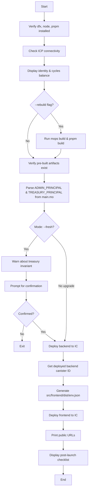

# Mainnet Launch Procedures

Comprehensive guide to deploying and managing `minegold.defi` on the Internet Computer Protocol (ICP) mainnet.

## Overview

Mainnet deployment involves taking the pre-built backend canister (`backend.wasm`) and frontend assets from a cold checkout to a live, publicly-accessible dApp on the ICP blockchain. The project supports two deployment strategies depending on whether you're upgrading existing infrastructure or creating a sovereign deployment.

**Critical invariant:** The backend code hardcodes `TREASURY_PRINCIPAL` which **must** equal the backend canister's own principal (`Principal.fromActor(Self)`) for ICRC-1 treasury operations to work correctly. Misconfiguration sends user deposits to the wrong account.

## Prerequisites

### Required Tools

| Tool    | Minimum Version | Purpose                                      |
| ------- | --------------- | -------------------------------------------- |
| `dfx`   | ≥ 0.24.0        | Internet Computer SDK                        |
| Node.js | ≥ 20            | Frontend build toolchain                     |
| `pnpm`  | ≥ 9             | Package manager                              |
| `mops`  | ≥ 1.11          | Motoko package manager (only for `--rebuild`) |

**Installation:**
```bash
# dfx
sh -ci "$(curl -fsSL https://internetcomputer.org/install.sh)"

# pnpm
corepack enable && corepack prepare pnpm@latest --activate

# mops (optional, for source rebuilds)
npm i -g ic-mops
```

### Identity & Cycles

**1. Configure dfx identity:**
```bash
dfx identity new minegold-prod   # or use existing
dfx identity use minegold-prod
dfx identity get-principal       # note this for ADMIN_PRINCIPAL
```

**2. Fund with cycles:**
First-time deployment requires ~**4 TC (trillion cycles)**.

```bash
# Option A: Cycles faucet (one-time, ~10 TC)
# https://internetcomputer.org/docs/current/developer-docs/getting-started/cycles/cycles-faucet

# Option B: Convert ICP to cycles via cycles ledger
dfx cycles top-up <canister-id> 2_000_000_000_000
```

## Deployment Paths

### Path 1: Upgrade Existing Canister (Recommended)

**When:** You control the existing Caffeine-deployed canister (`72fnc-ziaaa-aaaai-axk4q-cai`).

**Why:** Preserves the treasury invariant automatically since the canister principal remains unchanged.

```bash
# Verify you're a controller
dfx identity get-principal
# Add that principal as controller in Caffeine panel

# Import existing canister ID
echo '{"backend":{"ic":"72fnc-ziaaa-aaaai-axk4q-cai"}}' > canister_ids.json

# Deploy
./launch-mainnet.sh --upgrade
```

### Path 2: Fresh Deployment (Sovereign)

**When:** You want a completely independent deployment.

**Critical:** You **MUST** edit `src/backend/main.mo` before first deploy.

**Step-by-step:**

```bash
# 1. Pre-create backend canister to get its ID
dfx canister --network ic create backend
NEW_BACKEND_ID=$(dfx canister --network ic id backend)
echo "New backend will be: $NEW_BACKEND_ID"

# 2. Edit src/backend/main.mo
# Line 34:  ADMIN_PRINCIPAL → your dfx principal (from `dfx identity get-principal`)
# Line 46:  TREASURY_PRINCIPAL → $NEW_BACKEND_ID (the canister's own principal)

# Example diff:
# - let ADMIN_PRINCIPAL : Principal = Principal.fromText("<old-principal>");
# + let ADMIN_PRINCIPAL : Principal = Principal.fromText("abc123-def456-...");
#
# - let TREASURY_PRINCIPAL : Principal = Principal.fromText("72fnc-ziaaa-aaaai-axk4q-cai");
# + let TREASURY_PRINCIPAL : Principal = Principal.fromText("xyz789-abc123-...");

# 3. Rebuild and deploy
./launch-mainnet.sh --fresh --rebuild
```

⚠️ **Failure to update these principals will route all treasury ICRC-1 calls to the wrong account.**

## Launch Script (`launch-mainnet.sh`)

### What It Does



### Script Internals

The script performs these critical safety checks:

```bash
# Connectivity test
if ! dfx ping ic >/dev/null 2>&1; then
  r "Cannot reach the Internet Computer. Check your network."
  exit 1
fi

# Treasury principal extraction from source
HARDCODED_TREASURY="$(awk '/TREASURY_PRINCIPAL[[:space:]]*:/,/Principal\.fromText/' \
  src/backend/main.mo | grep -oE 'fromText\("[^"]+"\)' | head -1 | \
  sed 's/.*"\(.*\)".*/\1/' || true)"

# Fresh-mode safety prompt
if [[ "$MODE" == "fresh" ]]; then
  y "  --fresh mode: make sure you edited main.mo so TREASURY_PRINCIPAL"
  y "  matches the NEW canister id once dfx assigns it..."
  read -r -p "  Continue? [y/N] " ok
  [[ "$ok" =~ ^[Yy]$ ]] || exit 1
fi
```

### Generated `env.json`

The script injects runtime configuration into the frontend:

```json
{
  "backend_host": "https://icp-api.io",
  "backend_canister_id": "<deployed-backend-id>",
  "project_id": "minegold-defi-ic",
  "ii_derivation_origin": "undefined"
}
```

This allows the React frontend to locate the backend canister without hardcoding IDs.

## Post-Launch Checklist

**These steps are MANDATORY after every fresh deployment:**

### 1. Initialize ERC-20 Minter Deposit Address

One-time setup to establish the Ethereum deposit address:

```bash
dfx canister call --network ic backend selfInitializeMinterAddress
```

This calls the ICP ERC-20 minter canister (`nbsys-saaaa-aaaar-qaaga-cai`) to generate a deposit address unique to this backend canister.

### 2. Fund Treasury with sGLDT

The backend needs liquidity to pay out sGLDT to users who deposit UNI:

```bash
# From NNS dApp, Plug, or another ICRC-1 tool:
Recipient: <backend-canister-id>   # e.g., 72fnc-ziaaa-aaaai-axk4q-cai
Ledger:    i2s4q-syaaa-aaaan-qz4sq-cai  (sGLDT ledger)
Amount:    <desired liquidity pool>
```

### 3. Warm Treasury Cache

```bash
dfx canister call --network ic backend refreshTreasuryBalances
dfx canister call --network ic backend getTreasuryWalletInfo
# Should print ckUNI and sGLDT balances
```

### 4. Fund Canisters with Cycles

```bash
dfx cycles top-up --network ic <backend-id>  2_000_000_000_000  # 2 TC
dfx cycles top-up --network ic <frontend-id> 1_000_000_000_000  # 1 TC
```

### 5. Smoke Test

1. Visit `https://<frontend-id>.icp0.io`
2. Log in with Internet Identity
3. Navigate to Exchange page
4. Paste a small test UNI deposit transaction hash (Sepolia testnet recommended)
5. Watch admin panel for state transitions: `#pending` → `#confirmed` → `#paid`

**If the test deposit succeeds, mainnet launch is complete.**

## Day-to-Day Operations

See [[api-and-endpoints]] for full method documentation. Common admin tasks:

### Treasury Management

```bash
# Check cached balances
dfx canister call --network ic backend getTreasuryWalletInfo
# Returns: record { ckUNI = 123_456_789; sGLDT = 987_654_321; ... }

# Force refresh from ledgers
dfx canister call --network ic backend refreshTreasuryBalances
```

### Deposit Processing

```bash
# List all UNI deposits
dfx canister call --network ic backend getAllUNIDeposits

# Diagnose a specific deposit
dfx canister call --network ic backend diagnosePayoutAbility '(42)'
# Returns reasons if payout is blocked

# Retry a stuck payout
dfx canister call --network ic backend retryUNIDepositPayout '(42)'
```

### Admin Verification

```bash
# Am I admin?
dfx canister call --network ic backend isAdminCaller
# (true) or (false)
```

### Code Upgrades

```bash
# After editing backend code and rebuilding:
dfx deploy backend --network ic --mode upgrade
# Preserves stable state (deposits, user roles, treasury cache)
```

## Cycles Management

Canisters consume cycles for:
- Computation (query/update calls)
- Storage (stable memory)
- HTTP outcalls (Etherscan, CoinGecko APIs)

### Monitoring

```bash
# Check current cycle balance
dfx canister status backend --network ic
dfx canister status frontend --network ic
```

Backend logs will warn when cycles drop below safe thresholds.

### Top-Up Strategy

**Manual:**
```bash
dfx cycles top-up --network ic <backend-id> 1_000_000_000_000
```

**Automated (GitHub Actions example):**
```yaml
name: Top-Up Cycles
on:
  schedule:
    - cron: '0 0 * * 0'  # Weekly
jobs:
  topup:
    runs-on: ubuntu-latest
    steps:
      - uses: actions/checkout@v3
      - run: dfx cycles top-up --network ic ${{ secrets.BACKEND_ID }} 1000000000000
        env:
          DFX_IDENTITY: ${{ secrets.DFX_IDENTITY_PEM }}
```

**Recommended reserves:**
- Backend: keep ≥ 2 TC (covers ~1 month of moderate usage)
- Frontend: keep ≥ 500 billion cycles

## Troubleshooting

### "Unauthorized: admin only" on Every Call

**Cause:** Your dfx identity principal doesn't match the hardcoded `ADMIN_PRINCIPAL` in `main.mo`.

**Fix:**
1. Get your principal: `dfx identity get-principal`
2. Edit `src/backend/main.mo` line 34:
   ```motoko
   let ADMIN_PRINCIPAL : Principal = Principal.fromText("<your-principal>");
   ```
3. Rebuild and upgrade:
   ```bash
   cd src/backend && mops build
   dfx deploy backend --network ic --mode upgrade
   ```

### Treasury Balance Always 0 After Transfer

**Cause:** Cache not refreshed, or transfer went to wrong principal.

**Fix:**
```bash
# Refresh cache
dfx canister call --network ic backend refreshTreasuryBalances
dfx canister call --network ic backend getTreasuryWalletInfo

# If still 0, verify the transfer on sGLDT ledger went to:
# Principal: <backend-canister-id>  (NOT the wallet, NOT your identity)
```

### "Pre-built backend artifacts missing"

**Cause:** `src/backend/dist/backend.wasm` not present.

**Fix:**
```bash
./launch-mainnet.sh --rebuild
# Requires mops: npm i -g ic-mops
```

### Etherscan Polling Always Returns "pending"

**Cause:** HTTP outcalls to Etherscan API are failing.

**Workaround:**
```bash
# After the Ethereum transaction confirms on Etherscan, manually retry:
dfx canister call --network ic backend retryUNIDepositPayout '(<deposit-id>)'
```

**Long-term fix:** Consider adding an Etherscan API key to the backend or switching to a more reliable ETH RPC provider.

### Cycles Running Low Warning

**Cause:** Canister approaching cycle depletion.

**Immediate action:**
```bash
dfx cycles top-up --network ic <backend-id> 2_000_000_000_000
```

**Prevention:** Set up automated top-up (see Cycles Management above).

### Frontend Shows "CANISTER_ID_BACKEND is not set"

**Cause:** `src/frontend/dist/env.json` missing or incorrect.

**Fix:**
```bash
./scripts/sync-env.sh --ic
# Regenerates env.json with current canister IDs
```

## Local vs. Mainnet Key Differences

| Aspect                  | Local (`launch.sh`)                                  | Mainnet (`launch-mainnet.sh`)                          |
| ----------------------- | ---------------------------------------------------- | ------------------------------------------------------ |
| **Replica**             | `127.0.0.1:4943` (local dfx replica)                 | Internet Computer blockchain                           |
| **Internet Identity**   | Deployed locally, ephemeral                          | Uses production II (`rdmx6-jaaaa-aaaaa-aaadq-cai`)     |
| **Treasury ledgers**    | Reads **mainnet** ledgers via `https://icp-api.io`   | Reads mainnet ledgers via `https://icp-api.io`         |
| **Costs**               | Free (local computation)                             | Cycles consumed (~4 TC initial, ongoing top-ups)       |
| **Admin bootstrapping** | Script calls `assignCallerUserRole` automatically    | Manual: must edit `ADMIN_PRINCIPAL` in source          |
| **State persistence**   | Lost on `dfx stop` unless using `--clean=false`      | Permanent (stored on-chain in stable memory)           |
| **HTTP outcalls**       | Work if your machine has internet                    | Canister makes outcalls directly                       |
| **Public access**       | Only accessible from localhost                       | Globally accessible at `https://<id>.icp0.io`          |

**Note:** Even in local mode, the backend queries **production mainnet ledgers** for sGLDT and ckUNI balances. This is intentional — the local replica backend acts as a read-only view into real treasury state.

## Related Documentation

- [[build-and-deploy-process]] — General build/deploy overview
- [[local-deployment-with-dfx]] — Local development workflow
- [[api-and-endpoints]] — Backend canister API reference
- [[project-configuration]] — `dfx.json`, `mops.toml`, environment variables
- [[security-audit-findings]] — Security considerations for production
- [[state-management]] — How state survives upgrades

## Security Considerations for Production

Before mainnet launch, review [[security-audit-findings]] for:

1. **Principal validation** — Ensure `ADMIN_PRINCIPAL` and `TREASURY_PRINCIPAL` are correct
2. **Cycle monitoring** — Set up alerts for low cycle balance
3. **Upgrade hygiene** — Test upgrades on local replica first, use `--mode upgrade` to preserve state
4. **API key rotation** — If using Etherscan/CoinGecko API keys, rotate periodically
5. **Treasury funding** — Never over-fund the treasury beyond what's needed for near-term payouts

## Launch Command Reference

```bash
# Mainnet upgrade (existing canister)
./launch-mainnet.sh --upgrade

# Fresh sovereign deployment (edit principals first!)
./launch-mainnet.sh --fresh --rebuild

# Mainnet upgrade with rebuild
./launch-mainnet.sh --upgrade --rebuild

# Help
./launch-mainnet.sh --help
```

---

**Last updated:** 2026-05-02  
**Source files:** `LAUNCH.md`, `launch-mainnet.sh`, `launch.sh`