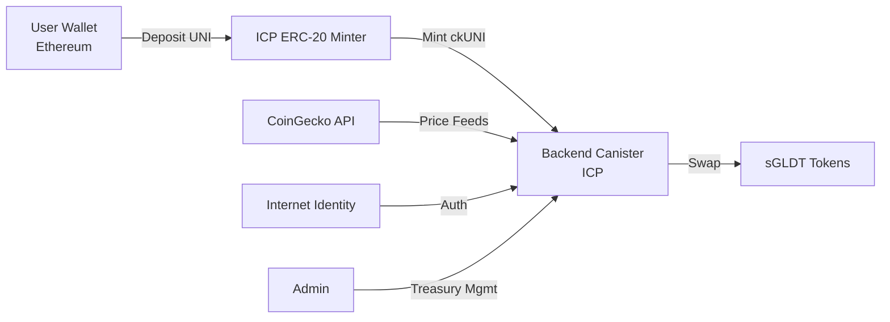

# Project Overview: Minegold.brave

## What It Is

**minegold.defi** is a **cross-chain DeFi refinery** that bridges Uniswap (UNI) tokens from Ethereum to the Internet Computer Protocol (ICP) and refines them into gold-backed sGLDT tokens.

Think of it as a multi-stage token transformation pipeline:
```
UNI (Ethereum) → ckUNI (ICP wrapped) → sGLDT (gold-backed)
```

## Core Value Proposition

The platform enables users to:
1. **Bridge** UNI tokens from Ethereum to ICP using ICP's official ERC-20 minter
2. **Refine** those bridged tokens (ckUNI) into gold-backed sGLDT tokens
3. **Track** full transaction history with status indicators
4. **Manage** treasury operations (admin only)

The "refinery" metaphor is deliberate — raw materials (UNI) are processed through stages into refined output (gold-backed tokens).

## Tech Stack Summary

**Frontend:**
- React/TypeScript application
- Brave wallet integration for ETH/UNI balance queries
- Internet Identity for ICP authentication
- Live CoinGecko price feeds
- See [[frontend-architecture-and-ui]] for details

**Backend:**
- Internet Computer canisters (Motoko)
- ICRC-1 token standard compliance
- Integration with ICP's official ERC-20 minter for automated ckUNI minting
- See [[backend-core-implementation]] for details

**Infrastructure:**
- Docker containerization (see [[containerized-development-environment]])
- Caffeine platform deployment (see [[caffeine-platform-integration]])
- Multi-network support (local, testnet, mainnet)

## Key Features

### 1. Automated Cross-Chain Bridge
- **UNI → ckUNI** conversion via ICP's official ERC-20 minter canister
- No manual bridging steps — fully automated
- Maintains 1:1 peg between UNI and ckUNI

### 2. sGLDT Refinery
- **ckUNI → sGLDT** swap with live exchange rates
- Gold-backed token output (sGLDT)
- Dynamic pricing based on market rates
- See [[token-economics-and-exchange-rates]] for rate calculation

### 3. Full Transaction History
- Complete audit trail for all user operations
- Status indicators (pending, confirmed, failed)
- Per-user transaction isolation
- See [[data-flow-and-transaction-lifecycle]] for how transactions are tracked

### 4. Wallet Integration
- **Brave Wallet** for Ethereum-side operations
- Live balance displays: ETH, UNI, sGLDT
- **Internet Identity** for ICP-side authentication
- Seamless multi-wallet UX

### 5. Admin Treasury Management
- Admin-only panel for treasury operations
- Monitor reserves and liquidity
- Manage cross-chain inventory
- See [[api-and-endpoints]] for admin API surface

### 6. Standards Compliance
- **ICRC-1** compliant token transfers on ICP side
- Ensures interoperability with ICP ecosystem
- Standard token interfaces for wallets and dapps

## Project Category

**Category:** DeFi / Finance  
**Tags:** defi, bridge, cross-chain, icp, ethereum, uniswap, icrc1, gold, wallet

## Architecture at a Glance



## Design Philosophy

From `DESIGN.md` (minimal brief currently):
- Focus on design direction, tone, and differentiation
- Emphasis on structural zones, component patterns, and signature details
- UI aims for clear, trustworthy DeFi experience

See [[frontend-architecture-and-ui]] for implemented design patterns.

## Developer Workflow

From `AGENTS.md` verified commands:

**Frontend** (from `src/frontend/`):
```bash
pnpm install --prefer-offline
pnpm typecheck
pnpm fix          # lint
pnpm build
```

**Backend** (from `src/backend/`):
```bash
mops install      # Motoko package manager
mops check --fix  # typecheck
mops build
```

**Integration** (from root):
```bash
pnpm bindgen      # Generate frontend → backend bindings
```

See [[developer-tooling-and-automation]] and [[deployment-scripts-and-automation]] for full build/deploy workflows.

## Deployment Targets

1. **Local Development** — dfx local replica
2. **Testnet** — ICP playground network
3. **Mainnet** — Production ICP network
4. **Caffeine** — Hosted deployment platform

See [[mainnet-launch-procedures]] and [[deployment-scripts-and-automation]] for deployment processes.

## Security Considerations

The project underwent a formal security audit. Key findings and mitigations documented in:
- [[security-audit-findings]] — audit report analysis
- [[edge-cases-and-gotchas]] — known sharp edges
- [[testing-and-quality-assurance]] — test coverage

## Related Documentation

**Core Implementation:**
- [[backend-core-implementation]] — canister logic, state management
- [[frontend-architecture-and-ui]] — React app structure
- [[api-and-endpoints]] — public and admin API surface

**Token Flow:**
- [[token-economics-and-exchange-rates]] — pricing and rate calculation
- [[data-flow-and-transaction-lifecycle]] — how transactions move through the system
- [[state-management]] — how balances and state are tracked

**Operations:**
- [[deployment-scripts-and-automation]] — build and deploy tooling
- [[mainnet-launch-procedures]] — production launch checklist
- [[canister-upgrade-mechanisms]] — upgrade patterns

**Development:**
- [[developer-tooling-and-automation]] — CLI tools, scripts
- [[environment-and-workspace-configuration]] — env setup
- [[containerized-development-environment]] — Docker setup
- [[project-dependencies]] — key libraries and frameworks
- [[patterns-and-conventions]] — code style and standards

## Quick Start

1. **Clone and install:**
   ```bash
   cd src/frontend && pnpm install --prefer-offline
   cd ../backend && mops install
   ```

2. **Generate bindings:**
   ```bash
   cd ../.. && pnpm bindgen
   ```

3. **Deploy locally:**
   ```bash
   ./deploy.sh  # or see deployment scripts
   ```

4. **Access the app:**
   - Frontend runs on local dfx server
   - Connect Brave wallet for Ethereum operations
   - Use Internet Identity for ICP authentication

See [[containerized-development-environment]] for Docker-based setup.

## Project Status

- **Last Updated:** 2026-04-09
- **Status:** Production-ready (mainnet procedures documented)
- **Origin:** Exported from [Caffeine](https://caffeine.ai/) platform
- **Security:** Formal audit completed (see [[security-audit-findings]])

## Why This Architecture?

**Why bridge UNI specifically?**
- Uniswap governance token has strong liquidity on Ethereum
- ICP's official ERC-20 minter supports UNI, enabling trustless bridging
- Provides familiar on-ramp for DeFi users

**Why Internet Computer?**
- Low transaction costs compared to Ethereum
- Web-speed finality (2-3 seconds)
- Internet Identity provides seamless auth without browser extensions
- ICRC-1 standard enables ecosystem interoperability

**Why gold-backed tokens?**
- sGLDT provides stability compared to volatile crypto assets
- Bridges DeFi liquidity to real-world asset exposure
- Unique value proposition in cross-chain DeFi space

## Common Workflows

**User deposits UNI and gets sGLDT:**
1. User connects Brave Wallet (Ethereum)
2. User approves UNI deposit to ICP ERC-20 minter
3. Backend detects deposit, mints ckUNI 1:1
4. User swaps ckUNI → sGLDT at current exchange rate
5. sGLDT appears in user's ICP wallet
6. Transaction recorded in history

See [[data-flow-and-transaction-lifecycle]] for detailed flow.

**Admin manages treasury:**
1. Admin authenticates via Internet Identity
2. Accesses admin panel (role-gated)
3. Views current reserves (ckUNI, sGLDT)
4. Executes treasury operations (if needed)
5. Monitors cross-chain balance health

See [[api-and-endpoints]] for admin capabilities.

## Troubleshooting Entry Points

- **Build issues:** [[developer-tooling-and-automation]], [[environment-and-workspace-configuration]]
- **Deployment failures:** [[deployment-scripts-and-automation]], [[mainnet-launch-procedures]]
- **Transaction stuck:** [[data-flow-and-transaction-lifecycle]], [[edge-cases-and-gotchas]]
- **Price discrepancies:** [[token-economics-and-exchange-rates]]
- **Security concerns:** [[security-audit-findings]]
- **Canister upgrade:** [[canister-upgrade-mechanisms]]
