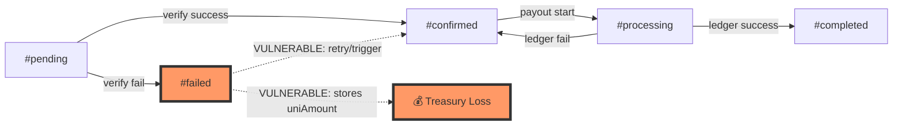
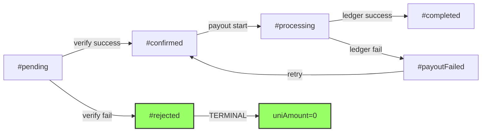

# Security Audit Findings & Remediation

**Audit Date:** 2026-05-02  
**Status:** ⚠️ **DO NOT LAUNCH** — Critical vulnerabilities in payout logic must be fixed first  
**Related:** [[api-and-endpoints]] · [[state-management]] · [[key-components]]

## Executive Summary

Two critical vulnerabilities can lead to **unauthorized sGLDT payouts from the treasury**:

1. **Failed Ethereum transactions can be converted into retryable payouts**
2. **ETH address ownership is not required** before deposit registration, allowing attackers to claim other users' deposits

The treasury must not be funded until these payout paths are fixed and redeployed.

---

## Critical Findings

### C-01: Failed ETH Transactions Can Still Trigger sGLDT Payout

**Severity:** 🔴 Critical  
**Attack Vector:** Authenticated user submits a *reverted* Ethereum transaction hash with a positive UNI amount

#### Vulnerable Code Flow

```motoko
// src/backend/main.mo:3401-3420
// verifyEthTransaction marks failure but keeps claimed uniAmount
case (#failed) {
  let request = {
    submitter = existingRequest.submitter;
    txHash = existingRequest.txHash;
    uniAmount = existingRequest.uniAmount;  // ⚠️ Keeps attacker's claimed amount
    lockedExchangeRate = existingRequest.lockedExchangeRate;
    status = #failed;  // Marked as failed...
  };
  uniDeposits.add(requestId, request);
}

// src/backend/main.mo:1996-2001
// verifyAndPayUNIDeposit treats #failed like a payout-eligible retry state
case (#failed) {
  return "rejected: deposit failed Ethereum/on-chain verification and cannot be retried";
};
case (#confirmed) {
  // Proceeds to payout...
};

// src/backend/main.mo:2290-2319 & 2361-2381
// retryUNIDepositPayout and triggerSGLDTPayout reset #failed → #confirmed
// WITHOUT re-checking Etherscan, then call payout
```

#### Attack Scenario

1. Attacker submits a deposit with a **reverted Ethereum tx hash** (e.g., failed due to insufficient gas)
2. `verifyEthTransaction` marks it `#failed` but stores the claimed `uniAmount`
3. Attacker calls `triggerSGLDTPayout` or `retryUNIDepositPayout`
4. Status flips from `#failed` → `#confirmed` without Etherscan re-check
5. **Treasury pays out sGLDT** even though no valid UNI deposit occurred

#### Remediation

```motoko
// Make failed ETH receipts terminal and unpayable
- Split payout failure from ETH verification failure:
  - #payoutFailed (can retry) vs. #rejected (terminal, cannot pay)
- Do not allow payout from #failed records
- Require explicit verified flag before transfer
- For defense in depth, have verifyAndPayUNIDeposit re-check
  verified flag or run final calldata verification before transfer
```

---

### C-02: Deposit Registration Does Not Require ETH Address Ownership Proof

**Severity:** 🔴 Critical  
**Attack Vector:** Front-running unclaimed UNI deposits by claiming the victim's ETH address

#### Vulnerable Code Flow

```motoko
// src/backend/main.mo:2469-2491
// _bindOrCheckEthAddress binds ETH address to FIRST caller with no signature
case null {
  ?(
    "ethAddress 0x" # key #
    " is not verified for this ICP principal. Complete the one-time " #
    "wallet ownership verification before submitting a deposit."
  );
};

// src/backend/main.mo:1779-1787, 1911-1922
// autoFinalizeUNIDeposit accepts caller-supplied ethAddress
// Does NOT call _bindOrCheckEthAddress at all
public shared(msg) func autoFinalizeUNIDeposit(
  ethAddress : Text,
  uniAmountE8 : Nat
) : async Text {
  let caller = msg.caller;
  // ⚠️ No ownership proof required!
  // Scans ethAddress and creates deposit record for caller
}
```

#### Attack Scenario

1. Victim sends UNI to treasury from address `0xVICTIM`
2. Attacker monitors Etherscan and spots the unclaimed deposit
3. **Before victim claims**, attacker calls `autoFinalizeUNIDeposit("0xVICTIM", amount)`
4. Canister records the request under **attacker's ICP principal**
5. Calldata verification passes (tx is real), **treasury pays attacker**

#### Remediation

```motoko
// Require cryptographic binding before ANY deposit registration
- Enforce bindEthAddressEip191 or bindEthAddressViaTx before submitUNIDeposit
- Remove automatic first-use binding
- Add binding enforcement to autoFinalizeUNIDeposit
- In payout verification, require:
    ethAddressBinding[tx.from] == request.submitter
- Consider disabling autoFinalizeUNIDeposit until fixed
```

---

## High Severity Findings

### H-01: Public HTTP Outcalls Allow Cycle and API-Key DoS

**Severity:** 🟠 High  
**Impact:** Anyone can burn canister cycles and exhaust the shared Etherscan API key

#### Vulnerable Endpoints

```motoko
// src/backend/main.mo:3093-3104
public func getEthBalanceOnchain(addr : Text) : async Nat {
  // Unauthenticated, performs Etherscan outcall
  // Costs 5B cycles per call (see _httpGetBounded)
}

public func getWalletBalances(addr : Text) : async WalletBalances {
  // Can perform TWO Etherscan outcalls
  // Cache is per-address, bypassed with new addresses
}

public func getUniBalanceOnchain(addr : Text) : async Nat {
  // Unauthenticated, performs Etherscan outcall
}
```

#### Attack Scenario

- Attacker repeatedly calls these methods with arbitrary addresses
- Each call burns 5B cycles from canister
- Shared Etherscan API key gets rate-limited or exhausted

#### Remediation

- Require authenticated callers for canister-side balance outcalls
- Add per-principal and global rate limits
- Cache zero/error responses to avoid repeated misses
- Prefer frontend public RPC reads for anonymous users

---

### H-02: Etherscan API Key Is Committed and Bundled

**Severity:** 🟠 High  
**Exposure:** API key is embedded in both backend WASM and frontend bundle

```motoko
// src/backend/main.mo:298
let ETHERSCAN_API_KEY = "ABCD1234..."  // ⚠️ Hardcoded in source
```

```typescript
// src/frontend/src/lib/eth.ts:165
const ETHERSCAN_KEY = "ABCD1234..."  // ⚠️ Shipped in browser code
```

#### Remediation

1. **Rotate the key immediately**
2. Remove committed defaults; initialize via admin call post-deploy
3. Do not ship key in frontend — use public RPC fallback or rate-limited backend proxy

---

## Medium Severity Findings

### M-01: Any Caller Can Read Any User's Transaction History

```motoko
// src/backend/main.mo:427-433
public query func getUserTransactions(user : Principal) : async [Transaction] {
  // ⚠️ No auth check — returns full tx list for ANY principal
}
```

**Impact:** Transaction hashes, amounts, statuses exposed for any known principal

**Fix:** Require `caller == user || isAdmin(caller)`, or remove and keep only `getMyTransactions`

---

### M-02: Dev/Build Dependency Advisories

`pnpm audit` found:

- `esbuild <=0.24.2` via Vite: GHSA-67mh-4wv8-2f99
- `vite <=6.4.1`: GHSA-4w7w-66w2-5vf9
- `postcss <8.5.10`: GHSA-qx2v-qp2m-jg93

**Fix:** Upgrade Vite to pull patched esbuild, upgrade PostCSS to >=8.5.10

---

## Positive Security Controls Observed ✅

```motoko
// Duplicate transaction hash tracking
seenTxHashes : TrieMap.TrieMap<Text, ()>

// Atomic status transition before async ledger call
let processingRequest = { request with status = #processing };
uniDeposits.add(requestId, processingRequest);
// ↑ Prevents race conditions in Motoko's single-threaded model

// Minimum confirmations check for confirmed payout path
if (confirmations < MIN_CONFIRMATIONS) {
  return "pending: waiting for confirmations";
}

// _verifyDepositCalldata validates:
// - Helper contract address
// - Token address (UNI)
// - Amount (18-decimal wei → e8s exact match)
// - Treasury principal (this canister)
let selector = _sliceText(input, 0, 8);
if (selector != DEPOSIT_SELECTOR) {
  return "mismatch: selector is not deposit(address,uint256,bytes32)";
}

// Admin transfer caps (per-call limits)
if (amount > ADMIN_TRANSFER_CAP) {
  return #err("transfer exceeds per-call cap");
}
```

---

## HTTP Outcall Cost Optimization

The codebase includes a clever optimization for Etherscan balance checks:

```motoko
// src/backend/main.mo:3011-3049
/// Bounded HTTPS GET outcall. Caps `max_response_bytes` at `maxBytes` so
/// the replica only charges for that much response capacity instead of the
/// 2MB default (which is ~270 BILLION cycles per call). Etherscan balance
/// responses are ~80 bytes; 2 KB is ample. Drops ~1000x from call cost.
func _httpGetBounded(url : Text, maxBytes : Nat) : async Text {
  let args : IC.http_request_args = {
    url;
    max_response_bytes = ?(Nat64.fromNat(maxBytes));  // ⚠️ Critical: caps at 2KB
    // ...
    // IMPORTANT: must be unreplicated. Etherscan returns slightly different
    // balances to different replicas when the chain tip advances between
    // their requests (millisecond-level race). Replicated outcalls then
    // fail with "No consensus could be reached". Unreplicated mode routes
    // the call through a SINGLE replica whose response is signed.
    is_replicated = ?false;
  };
  let cycles : Nat = 5_000_000_000;  // 5B buffer, unused refunded
  await (with cycles = cycles) IC.http_request(args);
}
```

**Why this matters:**

- Default 2MB response buffer = ~270B cycles per call
- With 2KB cap = ~270M cycles per call (1000x reduction)
- Unreplicated mode = 1/13 cost on 13-node subnet
- **Final cost:** few hundred million cycles instead of hundreds of billions

---

## Priority Remediation Plan

### Phase 1: Critical Fixes (Pre-Launch Blockers)

1. ✅ **Patch C-01 immediately**
   - Make ETH-failed deposits terminal (`#rejected` not `#failed`)
   - Remove all payout paths from failed tx receipts
   - Add `uniAmount = 0` terminal guard enforcement

2. ✅ **Patch C-02 immediately**
   - Require cryptographic ETH binding before ANY deposit creation
   - Add `ethAddressBinding[tx.from] == request.submitter` check in payout

3. ✅ **Temporarily disable risky endpoints**
   - Admin-gate `autoFinalizeUNIDeposit`
   - Admin-gate `triggerSGLDTPayout`
   - Admin-gate `retryUNIDepositPayout`

4. ✅ **Add regression tests**
   - Reverted tx cannot be paid
   - Calldata mismatch rejected
   - Unbound address rejected
   - Bound-address mismatch rejected
   - Duplicate hash rejected
   - Payout retry from legitimate #payoutFailed works

### Phase 2: High-Priority Hardening

5. Rate-limit public HTTP outcalls (H-01)
6. Rotate and remove exposed Etherscan API key (H-02)
7. Fix `getUserTransactions` privacy leak (M-01)

### Phase 3: Quality & Dependencies

8. Upgrade vulnerable dev/build dependencies (M-02)
9. Clear 83 Biome errors and 17 warnings
10. Establish Windows-compatible `mops check` workflow

---

## Testing Requirements Before Launch

```bash
# Critical path coverage required:
- [ ] Reverted tx → verify → payout attempt → REJECT
- [ ] Unbound ETH address → deposit → REJECT
- [ ] Bound to Principal A → Principal B submits → REJECT
- [ ] Legitimate deposit → verify → payout → SUCCESS
- [ ] Payout fails (ledger reject) → retry → SUCCESS
- [ ] Duplicate tx hash → second submit → REJECT
- [ ] Anonymous principal → payout attempt → REJECT
- [ ] Zero uniAmount record → payout attempt → REJECT
```

---

## Security Architecture Insights

### State Machine Vulnerability Pattern

The core issue is **insufficient state transitions** in the deposit lifecycle:



**Fixed model:**



---

## Related Documentation

- [[state-management]] — Deposit state transitions and TrieMap usage
- [[api-and-endpoints]] — Public endpoints and authentication model
- [[build-and-deploy-process]] — Test and deployment workflow
- [[project-configuration]] — Environment variables and API key management

---

## References

- Full audit report: `AUDIT_REPORT.md`
- Backend canister: `src/backend/main.mo`
- Frontend deposit flow: `src/frontend/src/App.tsx:1134-1143`
- Etherscan integration: `src/frontend/src/lib/eth.ts`